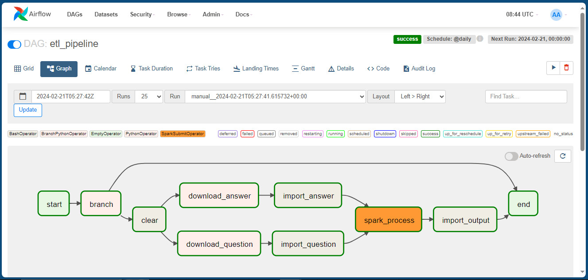
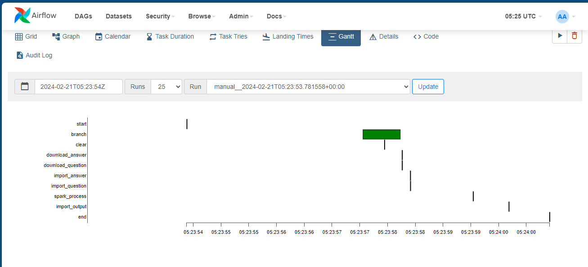

# bigdata-pipeline
## ETL pipeline 

### Introduction

A project presents the a data flow in practise. This sample use apache spark as a processing framework for big data and apache airflow for triggering the jobs. The repo contains DAG (pipeline graph) , pyspark script and docker components for the quickest setup environment.

### Requirements
Since the sample project was built based on docker-compose, there is nothing to install except Docker.
* Docker engine/desktop installed.
* At least 6GB of memory allocated for Docker. 
### Setup environment
Before run the docker-compose, we need to build the image for mongodb and airflow worker, the Dockerfile for each image is in the ./image directory with the structure below.

```bash
├── `image`
│   ├── `airflow_service`
│   │   ├── `Dockerfile`
│   ├── `mongo_service`
│   │   ├── `Dockerfile`
```

The .yml file describe all necessary elements of the system. To run within flower monitor, use the following command

```bash
docker-compose --profile flower -f docker-compose-env.yml up -d
```
Create spark connection in airflow for communication between airflow and spark
```
coming soon
```

### Adjust single service

In order to switch on/off a single service (flower for example) in the compose, we could use the following command.

```bash
# Delete a service
docker-compose rm -s -v yourService
# Open a service
docker-compose -f docker-compose-env.yml up -d yourService
```

### Monitoring 
Access the web dashboard for observing the data flow & status.
**Flower url**
    `localhost:5555/dashboard`
**Airflow url** 
    `localhost:8080`
We could use flower to monitor the workers, tasks and processes handled by each executor. Meanwhile, the airflow provide the WebUI dashboard to control the data pipeline. Once the respective url opened, we will see the similar UI below. The port could be edited in .yml file.
](snapshot/flower_branch2.jpg)

